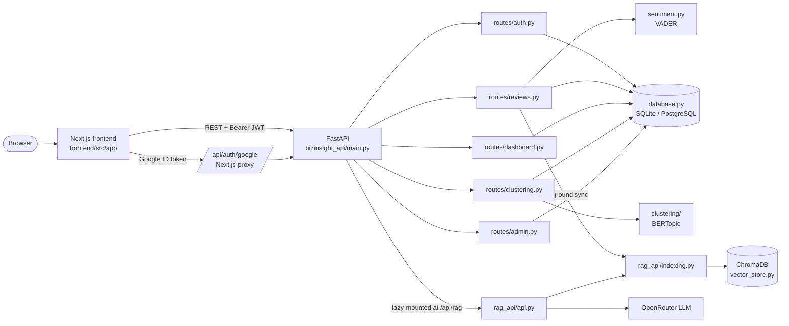

# BizInsight AI — Architecture

A quick mental model of how BizInsight AI fits together and which files to open first.

---

## System overview

---

## Request flows

**Upload.** `POST /api/reviews/upload` parses the CSV, scores each review with VADER, stores rows in the `feedback` table, and starts a background thread that rebuilds that user's vectors in ChromaDB.

**Dashboard & alerts.** `GET /api/dashboard/summary` and `/alerts` aggregate the user's rows with pandas: counts, percentages, a daily average-sentiment trend, and top keywords (scikit-learn `CountVectorizer`). Risk is *high* at ≥ 40 % negative reviews and *medium* at ≥ 25 %.

**Clustering.** `POST /api/clustering/run` starts a background thread running `clustering/run_clustering.py` (sentence embeddings → UMAP → HDBSCAN via BERTopic, then mapping each topic to a business category by embedding similarity). The client polls `/status/{job_id}` and fetches `/results/{job_id}`. Jobs live in memory, belong to the user who started them, and expire after an hour.

**AI assistant.** `POST /api/rag/chat`:
1. Identifies the caller from the optional Bearer token. Signed-out callers use the bundled demo dataset (`user_id = 0`).
2. Makes sure that user's reviews are indexed (vectors are rebuilt from the database if missing, e.g. after a redeploy).
3. Routes clearly negative or positive questions to reviews with matching sentiment.
4. Retrieves with MMR — always filtered by `user_id` — then expands the query (multi-query) and optionally re-ranks with a cross-encoder.
5. Asks the LLM to answer from those reviews only, in a fixed Summary / Key Themes / Notable Quotes format.

Without an LLM API key, step 5 is skipped and the most relevant reviews are returned instead.

---

## Key design decisions

- **Tenant isolation.** Every vector carries `user_id` metadata and every retrieval filters on it; every SQL query filters on `user_id`; clustering jobs check ownership.
- **Database is the source of truth.** ChromaDB is a rebuildable index (`rag_api/indexing.py`, `sync_vectors.py`), so ephemeral container disks are safe for vectors.
- **Low memory at boot.** The RAG stack (LangChain, ChromaDB, embedding models) is imported only on the first `/api/rag` request, and the LLM client only when needed, so the core API fits on 512 MB instances.
- **Stateless auth.** JWTs (HS256) in `Authorization` headers; no cookies, so CORS never needs credentials.

---

## Key files

| File | Purpose |
|---|---|
| `backend/bizinsight_api/main.py` | App setup, CORS, routers, lazy RAG mount |
| `backend/bizinsight_api/config.py` | Environment-driven settings (JWT, CORS, limits, thresholds) |
| `backend/bizinsight_api/routes/*.py` | REST endpoints |
| `backend/database.py` | Schema and queries for SQLite and PostgreSQL |
| `backend/rag_api/` | Chat endpoint, chains, vector store, indexing |
| `backend/clustering/run_clustering.py` | Topic clustering pipeline |
| `frontend/src/lib/api-client.ts` | Typed API client used by every page |
| `frontend/src/app/dashboard/*` | Authenticated app pages |
| `frontend/src/components/ChatPanel.tsx` | Chat UI shared by the dashboard and public demo |

---

## Getting oriented

1. Run the backend and open http://localhost:8001/docs to explore the API.
2. Read `bizinsight_api/main.py`, then the route you're changing.
3. Run `python -m pytest -q tests` in `backend/` before and after your change.
